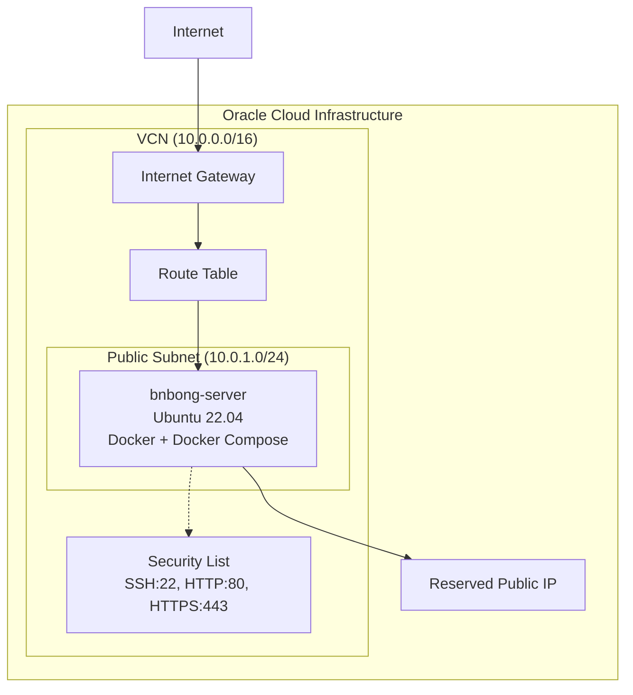
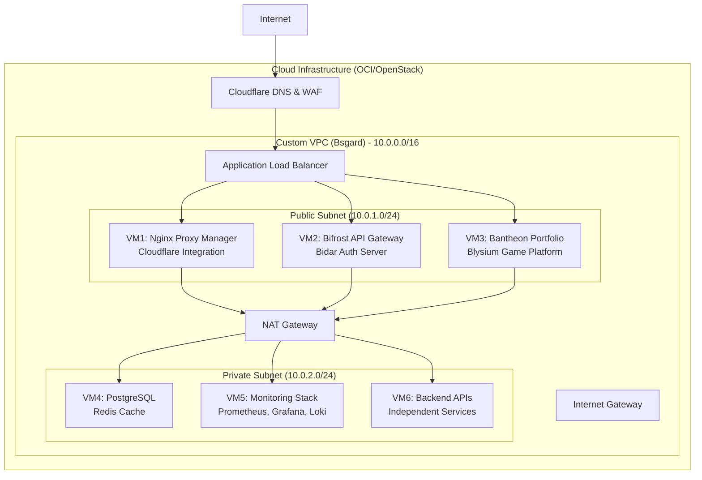

<p align="center">
    
</p>

<div align="center">

# 🏗️ Baedalus (Bnbong + daedalus)

**Infrastructure as Code for Cloud Nation**

[](https://terraform.io)
[](https://cloud.oracle.com)
[](https://ubuntu.com)

*Part of the [BNGdrasil](https://github.com/BNGdrasil/BNGdrasil) ecosystem - A comprehensive cloud infrastructure project*

</div>

---

## Overview

**Baedalus** is the Infrastructure as Code (IaC) foundation of the [BNGdrasil](https://github.com/BNGdrasil/BNGdrasil) cloud infrastructure project. Named after the master craftsman from Greek mythology, Baedalus provisions and manages cloud infrastructure across multiple cloud service providers (CSP) and prepares for eventual transition to OpenStack-based home lab environments.

### Key Features

- **Multi-Cloud Ready**: Designed for Oracle Cloud with AWS/Azure expansion planned
- **Declarative Infrastructure**: Terraform-based infrastructure management
- **Automated Deployment**: Complete CI/CD pipeline integration
- **Security Focused**: Network isolation with public/private subnet architecture
- **Scalable Design**: From single VM to multi-tier application architecture
- **Container Ready**: Docker and Docker Compose pre-configured
- **Cost Optimized**: ARM-based instances with efficient resource allocation

## Architecture

### Current Implementation (Phase 1)



### Target Architecture (Future Phases)



---

## Quick Start

### Prerequisites

- Terraform >= 1.0
- Oracle Cloud Infrastructure account
- OCI CLI configured or API key setup
- SSH key pair for instance access

### Installation

#### Using Makefile (Recommended)

```bash
# Clone the repository
git clone https://github.com/BNGdrasil/Baedalus.git
cd Baedalus

# Setup environment
make setup

# Initialize and deploy infrastructure
make init
make plan
make apply
```

#### Manual Setup

```bash
# Copy and configure environment variables
cp terraform.tfvars.example terraform.tfvars
# Edit terraform.tfvars with your OCI credentials

# Initialize and deploy
terraform init
terraform plan
terraform apply
```

### Access Points

Once deployed, you can access:

- **Instance SSH**: `ssh ubuntu@<public_ip>`
- **Application Services**: `http://<public_ip>:8000` (when applications are deployed)
- **Infrastructure Status**: `terraform show`

### Application Deployment

```bash
# Deploy applications to the provisioned infrastructure
make deploy SERVER_IP=<server_ip>

# Or use the deployment script directly
./scripts/deploy.sh <server_ip> [ssh_user]
```

---

## Infrastructure Configuration

### Core Components

- **VCN & Networking** (`main.tf`): Virtual Cloud Network with public/private subnet architecture
- **Compute Resources** (`main.tf`): ARM-based Ubuntu instances with auto-scaling capabilities
- **Security Configuration** (`main.tf`): Security lists, network ACLs, and access controls
- **Automation Scripts** (`scripts/`): Deployment and initialization automation
- **Variable Management** (`variables.tf`): Centralized configuration management

### Project Structure

```
infra/
├── main.tf                 # Main Terraform configuration
├── variables.tf            # Variable definitions
├── terraform.tfvars.example # Environment variables template
├── scripts/
│   ├── deploy.sh          # Application deployment script
│   └── user_data.sh       # Instance initialization script
├── Makefile               # Automation commands
└── README.md             # Project documentation
```

---

## Infrastructure Components

### Networking

- **VCN CIDR**: 10.0.0.0/16
- **Public Subnet**: 10.0.1.0/24 (current implementation)
- **Private Subnet**: 10.0.2.0/24 (planned)
- **Internet Gateway**: External connectivity
- **NAT Gateway**: Private subnet internet access (planned)

### Security

- **Security Lists**: SSH (22), HTTP (80), HTTPS (443)
- **Public IP**: Reserved static IP assignment
- **SSH Access**: Key-based authentication only

### Compute Resources

- **Instance Type**: VM.Standard.A1.Flex (ARM-based)
- **Operating System**: Canonical Ubuntu 22.04 LTS
- **Storage**: Boot volume with automatic expansion
- **Initialization**: Automated Docker setup via user_data

---

## Development Roadmap

### Phase 1: Basic Infrastructure ✅
- [x] Single VM deployment on OCI
- [x] Basic networking with public subnet
- [x] Docker containerization setup
- [x] Automated deployment scripts

### Phase 2: Multi-VM Architecture
- [ ] Private subnet implementation
- [ ] NAT Gateway for private resources
- [ ] Multiple VM deployment (6 VMs total)
- [ ] Load balancer configuration
- [ ] Database and cache services isolation

### Phase 3: Enhanced Security & Monitoring
- [ ] Enhanced security groups and rules
- [ ] Monitoring and logging infrastructure
- [ ] Backup and disaster recovery
- [ ] SSL/TLS certificate automation

### Phase 4: Multi-Cloud & OpenStack Migration
- [ ] Multi-CSP support (AWS, Azure)
- [ ] OpenStack provider integration
- [ ] Home lab infrastructure templates
- [ ] Hybrid cloud networking

---

## Makefile Commands

```bash
# View all available commands
make help

# Infrastructure management
make init          # Initialize Terraform
make plan          # Show deployment plan
make apply         # Apply infrastructure changes
make destroy       # Destroy infrastructure

# Code quality and validation
make lint          # Format and validate Terraform code
make validate      # Validate Terraform configuration

# Deployment and monitoring
make deploy        # Deploy applications
make output        # Show infrastructure outputs
make show          # Show current state
```

---

## API Reference

### Infrastructure Outputs

| Output | Description | Example |
|--------|-------------|---------|
| `public_ip` | Reserved public IP address of the main instance | `129.159.XXX.XXX` |
| `instance_id` | Oracle Cloud Infrastructure instance OCID | `ocid1.instance.oc1.iad.xxx` |

### Terraform State Management

```bash
# View current state
terraform show

# List all resources
terraform state list

# Get specific output
terraform output public_ip
```

### Resource Inspection

```bash
# Check instance status
terraform state show oci_core_instance.bnbong_server

# Validate configuration
terraform validate

# Plan changes
terraform plan
```

---

## Security

### Security Features

- **Network Isolation**: VCN with controlled subnet access
- **SSH Key Authentication**: Public key authentication only
- **Security Lists**: Configurable port-based access control
- **Reserved IP**: Static IP assignment for consistent access
- **Secret Management**: Environment-based credential storage
- **Audit Logging**: OCI native logging and monitoring

### Security Best Practices

1. **Never commit secrets** to version control
2. **Use environment variables** for OCI credentials
3. **Enable MFA** for OCI console access
4. **Configure security lists** restrictively for production
5. **Monitor infrastructure changes** regularly
6. **Keep Terraform state** secure and encrypted

---

## BNGdrasil Ecosystem

Baedalus is part of the larger **[BNGdrasil](https://github.com/BNGdrasil)** cloud infrastructure project:

- **🏗️ [Baedalus](https://github.com/BNGdrasil/Baedalus)** - Infrastructure as Code (this project)
- **🌉 [Bifrost](https://github.com/BNGdrasil/Bifrost)** - API Gateway & Service Mesh
- **🔐 [Bidar](https://github.com/BNGdrasil/Bidar)** - Authentication & Authorization Server
- **🌐 [Bsgard](https://github.com/BNGdrasil/Bsgard)** - Custom VPC & OpenStack Networking
- **🎨 [Bantheon](https://github.com/BNGdrasil/Bantheon)** - Web Frontend & Portfolio
- **🎮 [Blysium](https://github.com/BNGdrasil/Blysium)** - Gaming Platform

Each component is designed to work independently while integrating seamlessly with others.

---

## License

This project is used for personal learning and development purposes.