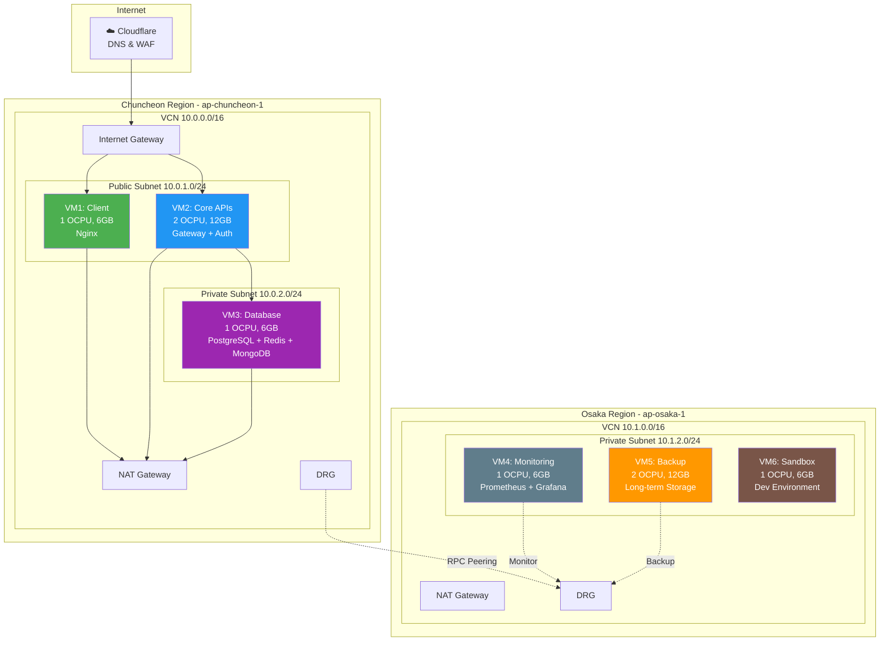

<p align="center">
    
</p>

<div align="center">

# 🏗️ Baedalus (Bnbong + daedalus)

**Multi-Region Cloud Infrastructure as Code**

[](https://terraform.io)
[](https://cloud.oracle.com)
[](https://ubuntu.com)

*Infrastructure as Code for [BNGdrasil](https://github.com/BNGdrasil/BNGdrasil) - A comprehensive cloud infrastructure project*

</div>

---

## 📋 Overview

**Baedalus** is a Terraform-based IaC project that manages the core infrastructure of the BNGdrasil project.

### 🌏 Multi-Region Architecture

- **Chuncheon Region (ap-chuncheon-1)**: Main Services (OCPU 4, RAM 24GB)
  - VM1 (1 OCPU, 6GB, 50GB): Client - Nginx reverse proxy & static files
  - VM2 (2 OCPU, 12GB, 50GB): Core APIs - Gateway + Auth Server
  - VM3 (1 OCPU, 6GB, 80GB): Database - PostgreSQL + Redis + MongoDB

- **Osaka Region (ap-osaka-1)**: Monitoring & Backup (OCPU 4, RAM 24GB)
  - VM4 (1 OCPU, 6GB, 80GB): Monitoring - Prometheus + Grafana + Loki
  - VM5 (2 OCPU, 12GB, 70GB): Backup - Long-term storage & remote backups
  - VM6 (1 OCPU, 6GB, 50GB): Sandbox - Development & testing environment

### 💰 Cost: $0 (OCI Free Tier)

All resources operate within Oracle Cloud Free Tier limits. Main services in Chuncheon region minimize cross-region data transfer costs.

---

## 🚀 Quick Start

### Prerequisites

- Terraform >= 1.0
- 2 Oracle Cloud Infrastructure accounts (Chuncheon, Osaka)
- SSH key pair
- OCI CLI setup (optional)

### Installation

```bash
# 1. Clone repository
cd infra

# 2. Environment setup
make setup

# 3. Edit terraform.tfvars
# Enter OCI credentials for both regions
vim terraform.tfvars

# 4. Deploy infrastructure
make init
make plan
make apply

# 5. Check outputs
make output
make show-ips
make show-ssh
```

### Quick Deploy (Fully Automated)

```bash
# Run everything at once
make quick-deploy
```

---

## 🏗️ Infrastructure Architecture

### Network Topology


```mermaid
graph TB
    subgraph "Internet"
        CF[☁️ Cloudflare<br/>DNS & WAF]
    end
    
    subgraph "Chuncheon Region - ap-chuncheon-1"
        subgraph "VCN 10.0.0.0/16"
            subgraph "Public Subnet 10.0.1.0/24"
                VM1[VM1: Client<br/>1 OCPU, 6GB<br/>Nginx]
                VM2[VM2: Core APIs<br/>2 OCPU, 12GB<br/>Gateway + Auth]
            end
            subgraph "Private Subnet 10.0.2.0/24"
                VM3[VM3: Database<br/>1 OCPU, 6GB<br/>PostgreSQL + Redis + MongoDB]
            end
            NAT1[NAT Gateway]
            IGW1[Internet Gateway]
            DRG1[DRG]
        end
    end
    
    subgraph "Osaka Region - ap-osaka-1"
        subgraph "VCN 10.1.0.0/16"
            subgraph "Private Subnet 10.1.2.0/24"
                VM4[VM4: Monitoring<br/>1 OCPU, 6GB<br/>Prometheus + Grafana]
                VM5[VM5: Backup<br/>2 OCPU, 12GB<br/>Long-term Storage]
                VM6[VM6: Sandbox<br/>1 OCPU, 6GB<br/>Dev Environment]
            end
            NAT2[NAT Gateway]
            DRG2[DRG]
        end
    end
    
    CF --> IGW1
    IGW1 --> VM1
    IGW1 --> VM2
    VM1 --> NAT1
    VM2 --> NAT1
    VM3 --> NAT1
    
    VM2 --> VM3
    DRG1 -.RPC Peering.-> DRG2
    VM4 -.Monitor.-> DRG2
    VM5 -.Backup.-> DRG2
    
    style VM1 fill:#4CAF50,color:#fff
    style VM2 fill:#2196F3,color:#fff
    style VM3 fill:#9C27B0,color:#fff
    style VM4 fill:#607D8B,color:#fff
    style VM5 fill:#FF9800,color:#fff
    style VM6 fill:#795548,color:#fff
```

### Resource Allocation

| VM | Location | OCPU | RAM | Storage | Role | Services |
|----|----------|------|-----|---------|------|----------|
| VM1 | Chuncheon (Public) | 1 | 6GB | 50GB | Client | Nginx reverse proxy + static files |
| VM2 | Chuncheon (Public) | 2 | 12GB | 50GB | Core APIs | Gateway + Auth Server + Redis |
| VM3 | Chuncheon (Private) | 1 | 6GB | 80GB | Database | PostgreSQL + Redis + MongoDB |
| VM4 | Osaka (Private) | 1 | 6GB | 80GB | Monitoring | Prometheus + Grafana + Loki |
| VM5 | Osaka (Private) | 2 | 12GB | 70GB | Backup | Long-term storage + remote backups |
| VM6 | Osaka (Private) | 1 | 6GB | 50GB | Sandbox | Development & testing environment |
| **Total** | **2 Regions** | **8** | **48GB** | **380GB** | - | **All within OCI Free Tier** |

---

## 📁 Project Structure

```
infra/
├── main.tf              # Providers and data sources
├── variables.tf         # Variable definitions
├── network.tf          # VCN, Subnet, Security Lists
├── chuncheon.tf        # Chuncheon region VM resources
├── osaka.tf            # Osaka region VM resources
├── outputs.tf          # Output values
├── terraform.tfvars.example  # Environment variable template
├── Makefile            # Automation commands
├── scripts/
│   ├── user_data_vm1.sh    # VM1 initialization script
│   ├── user_data_vm2.sh    # VM2 initialization script
│   ├── user_data_vm3.sh    # VM3 initialization script
│   ├── user_data_vm4.sh    # VM4 initialization script
│   ├── user_data_vm5.sh    # VM5 initialization script
│   ├── user_data_vm6.sh    # VM6 initialization script
│   └── deploy.sh           # Application deployment script
└── README.md           # This file
```

---

## 🔧 Configuration

### terraform.tfvars Setup

```hcl
# Chuncheon Region (Account 1)
tenancy_ocid_chuncheon     = "ocid1.tenancy.oc1..aaaaaa..."
user_ocid_chuncheon        = "ocid1.user.oc1..aaaaaa..."
fingerprint_chuncheon      = "xx:xx:xx:..."
private_key_path_chuncheon = "~/.oci/chuncheon_api_key.pem"
compartment_id_chuncheon   = "ocid1.compartment.oc1..aaaaaa..."

# Osaka Region (Account 2)
tenancy_ocid_osaka     = "ocid1.tenancy.oc1..aaaaaa..."
user_ocid_osaka        = "ocid1.user.oc1..aaaaaa..."
fingerprint_osaka      = "yy:yy:yy:..."
private_key_path_osaka = "~/.oci/osaka_api_key.pem"
compartment_id_osaka   = "ocid1.compartment.oc1..aaaaaa..."

# Service Configuration
domain_name       = "bnbong.com"
ssh_public_key    = "ssh-rsa AAAAB3NzaC1..."
postgres_password = "your-secure-password"
jwt_secret_key    = "your-secret-key-min-32-chars"
```

---

## 📝 Makefile Commands

### Basic Commands

```bash
make help          # Show all commands
make setup         # Initial environment setup
make init          # Initialize Terraform
make plan          # Review deployment plan
make apply         # Deploy infrastructure
make destroy       # Destroy infrastructure
```

### Code Quality

```bash
make fmt           # Format code
make validate      # Validate code
make lint          # Format + Validate
```

### State Management

```bash
make output        # Show all outputs
make show          # Show current state
make show-ips      # Show IP addresses only
make show-ssh      # Show SSH commands
make summary       # Resource summary
```

### SSH Access

```bash
make ssh-vm1       # Connect to VM1 (Public)
make ssh-vm2       # Connect to VM2 (Public)
make ssh-vm3       # Connect to VM3 (via Jump Host)
make ssh-vm4       # Connect to VM4 (via Jump Host)
make ssh-vm5       # Connect to VM5 (via Jump Host)
make ssh-vm6       # Connect to VM6 (via Jump Host)
```

### Deployment and Monitoring

```bash
make deploy-vm1    # Deploy to VM1
make deploy-vm2    # Deploy to VM2
make deploy-all    # Deploy all
make logs-vm1      # VM1 logs
make logs-vm2      # VM2 logs
make health        # Health check
```

---

## 🔐 Security

### Network Security

- **Public Subnet**: Only VM1, VM2 accessible from outside
- **Private Subnet**: VM3, VM4, VM5, VM6 internal network only
- **NAT Gateway**: Outbound traffic for private subnets
- **Security Lists**: Fine-grained port-based access control

### Access Control

- **SSH**: Key-based authentication only
- **Jump Host**: Private VMs accessed via VM2
- **Cloudflare**: WAF and DDoS protection
- **Secrets**: Sensitive information in terraform.tfvars (gitignored)

### Best Practices

1. ✅ Never commit `terraform.tfvars`
2. ✅ Store SSH keys securely
3. ✅ Enable MFA in OCI Console
4. ✅ Rotate secret keys regularly
5. ✅ Encrypt Terraform State

---

## 🚀 Deployment Workflow

### Step 1: Provision Infrastructure

```bash
# Create infrastructure
make init
make plan
make apply

# Verify creation
make output
make summary
```

### Step 2: Verify VM Access

```bash
# Access public VMs
make ssh-vm1
make ssh-vm2

# Access private VMs (via Jump Host)
make ssh-vm3
```

### Step 3: Deploy Applications

```bash
# Individual deployment
make deploy-vm1
make deploy-vm2

# Or deploy all
make deploy-all
```

### Step 4: Monitor Status

```bash
# Check service status
make health

# View logs
make logs-vm1
make logs-vm2

# Access Grafana (VM5)
ssh -L 3000:localhost:3000 ubuntu@<VM5_IP>
# http://localhost:3000
```

---

## 📊 Monitoring & Observability

### Prometheus (VM5)

- **URL**: `http://localhost:9090` (via SSH tunnel)
- **Metrics**: All VM and service metrics collected
- **Retention**: 30 days

### Grafana (VM5)

- **URL**: `http://localhost:3000` (via SSH tunnel)
- **Credentials**: admin / admin (initial password)
- **Dashboards**: VM resources, service status, API performance

### Loki (VM5)

- **URL**: `http://localhost:3100`
- **Log Retention**: 7 days
- **Sources**: Application logs from all VMs

---

## 🔄 Backup & DR

### Automated Backup (VM4)

- **Frequency**: Daily backup (midnight)
- **Retention**: 7 days
- **Location**: VM4 `/backups` directory

### PostgreSQL Replication (VM6)

- **Type**: Streaming Replication
- **Delay**: < 1 second
- **Purpose**: Disaster recovery, read load distribution

### Verify Backups

```bash
# Check VM4 backups
make ssh-vm4
ls -lh /opt/bnbong/postgres/backups/

# Check VM6 replica status
make ssh-vm6
docker exec vm6-postgres-replica pg_isready
```

---

## 🛠️ Troubleshooting

### VM Won't Start

```bash
# 1. Check VM status
make ssh-vm1
systemctl status bnbong-vm1.service

# 2. View logs
journalctl -u bnbong-vm1.service -f

# 3. Check Docker services
docker ps -a
docker-compose logs
```

### Database Connection Error

```bash
# Access VM4 to check PostgreSQL
make ssh-vm4
docker exec vm4-postgres pg_isready

# Test connection
docker exec vm4-postgres psql -U bnbong -d bnbong -c "SELECT 1;"
```

### Cross-Region Communication Issue

```bash
# Test connection from VM2 to VM4
make ssh-vm2
ping <VM4_PRIVATE_IP>
telnet <VM4_PRIVATE_IP> 5432
```

---

## 🎯 Future Roadmap

### Phase 1: Current (Complete) ✅
- [x] Multi-region infrastructure
- [x] 6 VM deployment
- [x] Public/Private subnet separation
- [x] Automated initialization scripts

### Phase 2: Improvements Planned
- [ ] Terraform Remote State (OCI Object Storage)
- [ ] CI/CD pipeline integration
- [ ] Auto-scaling configuration
- [ ] VPN or FastConnect setup

### Phase 3: Expansion
- [ ] Multi-CSP support (AWS, Azure)
- [ ] Kubernetes migration
- [ ] Service Mesh adoption
- [ ] OpenStack home lab integration

---

## 📚 Related Projects

- **🌉 [Bifrost](https://github.com/BNGdrasil/Bifrost)** - API Gateway
- **🔐 [Bidar](https://github.com/BNGdrasil/Bidar)** - Auth Server
- **🎨 [Bantheon](https://github.com/BNGdrasil/Bantheon)** - Web Client
- **🌐 [Bsgard](https://github.com/BNGdrasil/Bsgard)** - Custom VPC

---

## 📄 License

This project is used for personal learning and development purposes.

---

## 🤝 Contributing

This project is for personal learning purposes, but feedback and suggestions are always welcome!

---

<div align="center">

**[BNGdrasil](https://github.com/BNGdrasil) - Building a personal cloud nation, one service at a time.**

</div>
